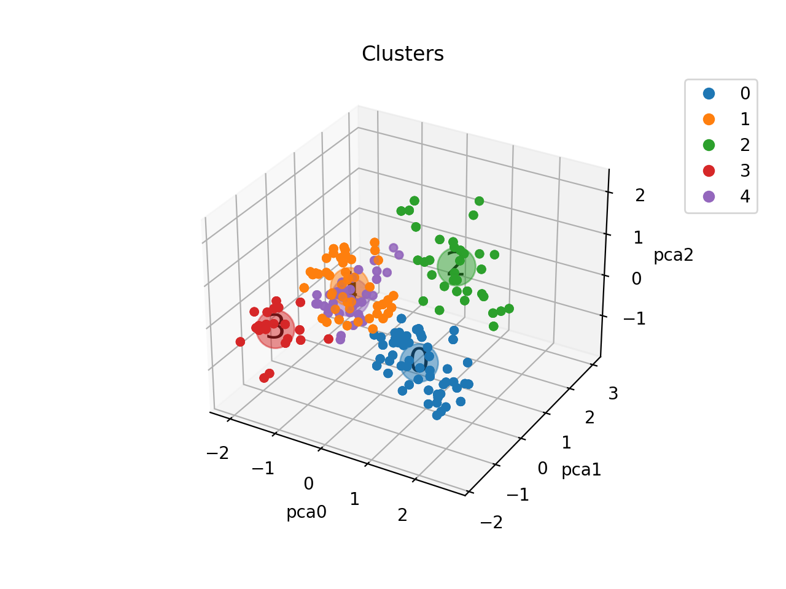
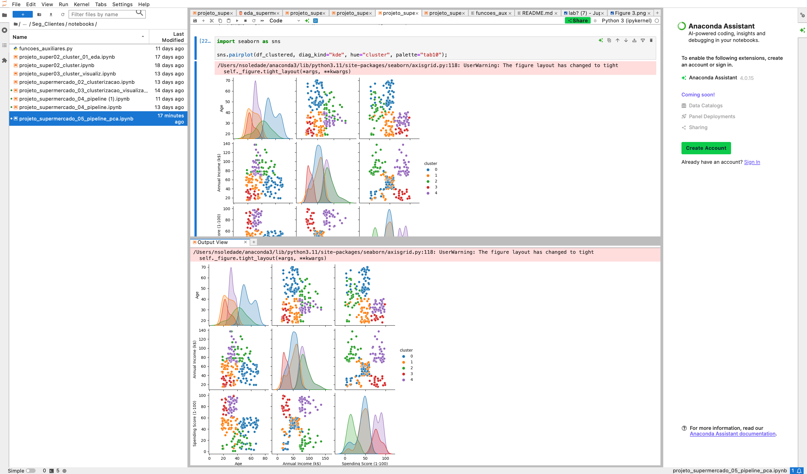

   # Segmentação de clientes de um supermercado
Um supermercado mantem os dados de seus clientes através de um cadastro de cartões de fidelidade. Estes cartões contem os seguintes dados: ID do cliente, idade, gênero, renda anual e escore de gastos. O escore de gastos é atribuído com base em parrâmetros de comportamento e datas de compras.

[Link original para o dataset](https://www.kaggle.com/vjchoudhary7/customer-segmentation-tutorial-in-python)

## Objetivo
Com base no comportamento dos clientes, segmentá-los em grupos de modo a subsidiar a área de marketing em estratégias para otimizar a abordagem com campanhas específicas para cada cada categoria.

## Projeto
Este projeto visa treinamento nos processos de tratamento de bases de dados para segmentação de clientes.

O seu desenvolvimento compreende as etapas de análise exploratória dos dados, pré-processamento e empregp do K-Means para segmentação dos clientes.

O projeto é estruturado com o uso de notebooks, scripts, relatórios e repositório no Github.

Buscou-se a utilização de boas práticas de programação em Python,como o uso de funções e scripts, e de pipelines no SciKit-Learn.

|--dados
|--imagens
|--modelos
|--notebooks
|--reports
...

Na pasta 'dados' está o dataset "Mall_Customers.csv", dataset obtido no Kaggle.

Na pasta 'imagens' estão as imagens apresentadas no README.md.

Na pasta 'modelos' estão os modelos gerados ao longo do projeto.

Na pasta 'notebooks' estão os notebooks desenvolvidos ao longo do projeto:
- ['projeto_supermercado_01_eda.ipynb'](notebooks/projeto_supermercado_01_eda.ipynb)
- -01_eda.ipynb): notebook com análise exploratória seaborn, boxplot e ydata-profiling.
- ['projeto_supermercado_04_pipeline.ipynb'](notebooks/projeto_supermercado_04_pipeline.ipynb): notebook com a clusterização dos dados usando K-Means **com pré-processamento** utilizando pipelines do Scikit-Learn.
- [`projeto_supermercado_05_pipeline_pca.ipynb`](notebooks/projeto_supermercado_05_pipeline_pca.ipynb): notebook com a clusterização dos dados usando K-Means após redução de dimensionalidade com PCA utilizando pipelines do Scikit-Learn.
- [`funcoes_auxiliares.py`](notebooks/funcoes_auxiliares.py): arquivo com funções auxiliares utilizadas nos notebooks.
- Na pasta `reports` estão os relatórios gerados durante o projeto utilizando a biblioteca [ydata-profiling](https://github.com/ydataai/ydata-profiling).

## Resultados
Foi montado um pipeline para execução das etapas de pré-processamento, PCA  e K-Means que resultou na segmentação da base em 5 clusters mostrados nas seguintes gráficos:

A tabela a seguir resume as 5 categorias:

| Pontuação de Gastos | Renda    | Idade   | Cluster |
| --------------------  ---------  --------  -------  
| Moderada            | Moderada | Alta    |  0      |
| Moderada            | Moderada | Jovem   |  1      |
| Baixa               | Alta     | Moderada|  2      |
| Alta                | Baixa    | Jovem   |  3      |
| Alta                | Alta     | Jovem   |  4      |

 
 

 

 
